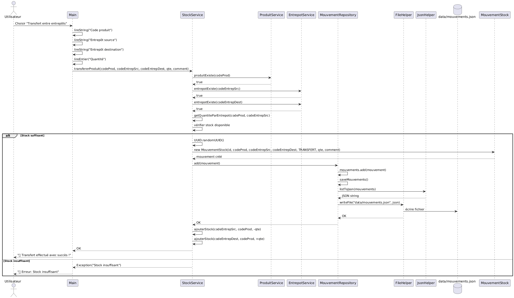
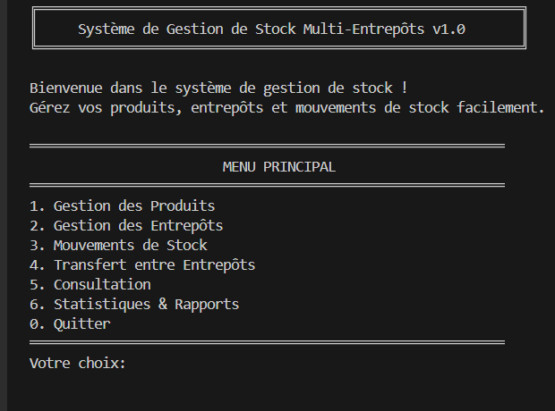
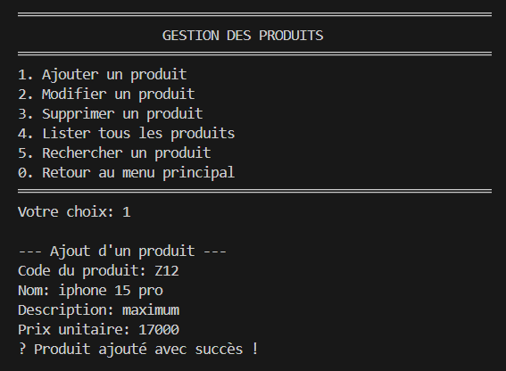
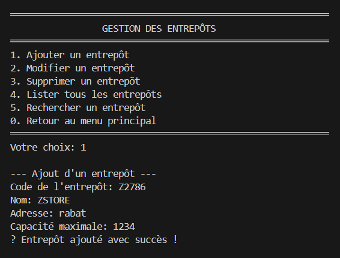
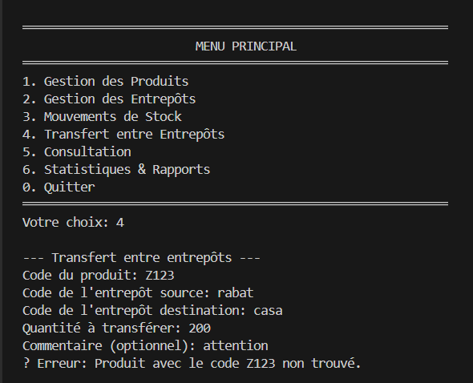
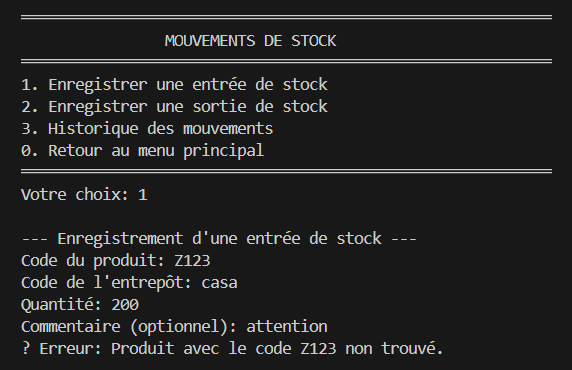

<!-- Professional English README for recruiter/professor -->
# 🚚 Multi-Warehouse Stock Management

Professional, modular Java console application for managing products across multiple warehouses with full audit of stock movements, transfers, and quantity reconciliation.

---

## Overview

Multi-Warehouse Stock Management provides a clear separation between domain models, persistence, and services to handle product lifecycle (CRUD), track stock movements (inbound/outbound), and perform transfers across warehouses. The system persists data to JSON files by default and computes available quantities dynamically from the movement history to guarantee consistency.

Multi-warehouse logic: each warehouse stores independent quantities for each product. All changes to stock are recorded as immutable movement records (ENTRY, EXIT, or TRANSFER). A transfer is implemented as two linked movements: an EXIT from the source warehouse and an ENTRY to the destination warehouse. The total stock for a product is the sum of quantities across all warehouses, computed from the movement log.

---

## Key Features

- CRUD for Products
- CRUD for Warehouses
- Record stock movements: ENTRY and EXIT
- Transfer products between warehouses (atomicized as EXIT + ENTRY movements)
- Historical movement log and filtering by product and date
- Compute per-warehouse and total product quantities from movement history
- Validation rules (prevent negative stock on EXIT/TRANSFER)
- JSON-backed persistence with automatic data file creation

---

## Tech Stack

- 
- 
- 
- 

Optional Database Support
- The current implementation uses JSON files under `data/` by default. For production or evaluation scenarios you can migrate storage to a relational DB (MySQL / PostgreSQL). The README below contains a minimal SQL schema and instructions for optional migration.

---

## Project Structure

```
java-multi-entrepots-stock/
├── README.md                       # Project documentation
├── Rapport_final.pdf               # rapport de projet
├── pom.xml                         # Maven configuration and dependencies
├── data/                           # Runtime JSON data files (auto-generated)
│   ├── produits.json               # Products data
│   └── entrepots.json              # Warehouses data
├── docs/                           # UML diagrams and project documentation
│   ├── CAHIER_DE_CHARGE.md
│   ├── CAHIER_DE_CHARGE.html
│   ├── cahier_de_charge (1).pdf
│   ├── diagramme_classes.png
│   ├── diagramme_sequence_ajouter_produit.png
│   ├── diagramme_sequence_consulter_stocker_.png
│   ├── diagramme_sequence_entre_stock.png
│   ├── diagramme_sequence_transfert.png
│   ├── screenshots/               # Console screenshots (demo)
│   │   ├── menu.png
│   │   ├── add_product.png
│   │   ├── stock_entry.png
│   │   ├── transfer.png
│   │   └── stock_consultation.png
└── src/main/java/com/project/stock/
    ├── models/                     # Domain models
    │   ├── Produit.java            # Product entity
    │   ├── Entrepot.java           # Warehouse entity
    │   └── MouvementStock.java     # Stock movement entity
    ├── repository/                 # Persistence layer (JSON repositories)
    │   ├── ProduitRepository.java
    │   ├── EntrepotRepository.java
    │   └── MouvementRepository.java
    ├── services/                   # Business logic and validations
    │   ├── ProduitService.java
    │   ├── EntrepotService.java
    │   └── StockService.java
    ├── utils/                      # Utility classes
    │   ├── FileHelper.java
    │   └── JsonHelper.java
    ├── exceptions/                 # Custom domain exceptions
    │   ├── ProduitNotFound.java
    │   └── EntrepotNotFound.java
    └── Main.java                   # Console entry point (interactive menu)

```

---

## Installation & Setup

Prerequisites

- Java JDK 11 or later
- Maven (optional but recommended)

Run (with Maven)

```bash
mvn clean compile
mvn exec:java -Dexec.mainClass="com.project.stock.Main"
```

Run (without Maven)

```bash
# Compile
javac -d target/classes src/main/java/com/project/stock/**/*.java
# Run
java -cp "target/classes;lib/*" com.project.stock.Main
```

Data files

On first run the application creates `data/produits.json`, `data/entrepots.json`, and `data/mouvements.json` if they do not exist.

Optional: MySQL migration

1. Create a database and import the following minimal schema (example for MySQL):

```sql
CREATE TABLE product (
    id VARCHAR(64) PRIMARY KEY,
    name VARCHAR(255) NOT NULL,
    sku VARCHAR(128)
);

CREATE TABLE warehouse (
    id VARCHAR(64) PRIMARY KEY,
    name VARCHAR(255) NOT NULL,
    location VARCHAR(255)
);

CREATE TABLE movement (
    id VARCHAR(64) PRIMARY KEY,
    product_id VARCHAR(64) NOT NULL,
    warehouse_id VARCHAR(64) NULL,
    type ENUM('ENTRY','EXIT','TRANSFER') NOT NULL,
    quantity INT NOT NULL,
    timestamp DATETIME NOT NULL,
    reference VARCHAR(255)
);
```

2. Implement or adapt repository classes to use JDBC / JPA instead of JSON. The current codebase has a single responsibility `repository` layer making this migration localized.

---

## Usage Notes

- Data consistency is ensured by deriving inventory quantities from the `mouvements` history. Avoid manual edits to `data/*.json` while the application is running.
- Transfers are recorded as paired movements. The application validates available stock before performing EXIT/TRANSFER operations.

---

## Documentation & UML

## 🖼️ Design & Conception (UML)

The system design follows a modular approach. Below are the core UML diagrams representing the architecture:

### Class Diagram


### Sequence Diagram (Example: Transfer Operation)


---

## 📋 Functional Analysis
Based on the project requirements, the following core functionalities were implemented:
- **Product & Warehouse Management:** Full CRUD operations.
- **Stock Movements:** Automated tracking of ENTRY and EXIT logs.
- **Atomic Transfers:** Ensures stock consistency when moving items between warehouses.
- **Real-time Inventory:** Dynamic calculation of stock levels from movement history.

---

## For Recruiters & Professors

This repository demonstrates:

- Clean separation of concerns (models, services, repositories)
- Transaction-like handling of transfers via paired movements
- Simple, testable persistence layer (JSON) with straightforward path to DB migration
- Input validation and domain-specific exceptions

If you would like, I can:

- Add a small SQL seed and automatic migration script
- Provide unit tests and sample data for a demo run
- Add a Dockerfile and a small UI to browse inventories

---

## Academic Context

- Module: Object-Oriented Programming (Java)
- Project type: Academic / Educational
- Authors:
    - Zahi El Houssine
    - Amine Louhani
    - Khalil Soufiane
  


## Console Demo (Screenshots)

### Main Menu


### Add Product


### Stock Entry


### Transfer Between Warehouses


### Stock Consultation



## Known Limitations

- File-based JSON persistence does not provide ACID transactions.
- Console interface is single-user and not suitable for concurrent access.
- No authentication or role management implemented.

## Future Improvements

- Replace JSON persistence with a relational database using JPA/Hibernate
- Add unit tests (JUnit) for service layer
- Implement REST API (Spring Boot)
- Add graphical or web-based user interface

---

If you'd like, I can also add a `README_small.md` with a one-page elevator pitch and sample commands for quick evaluation.


